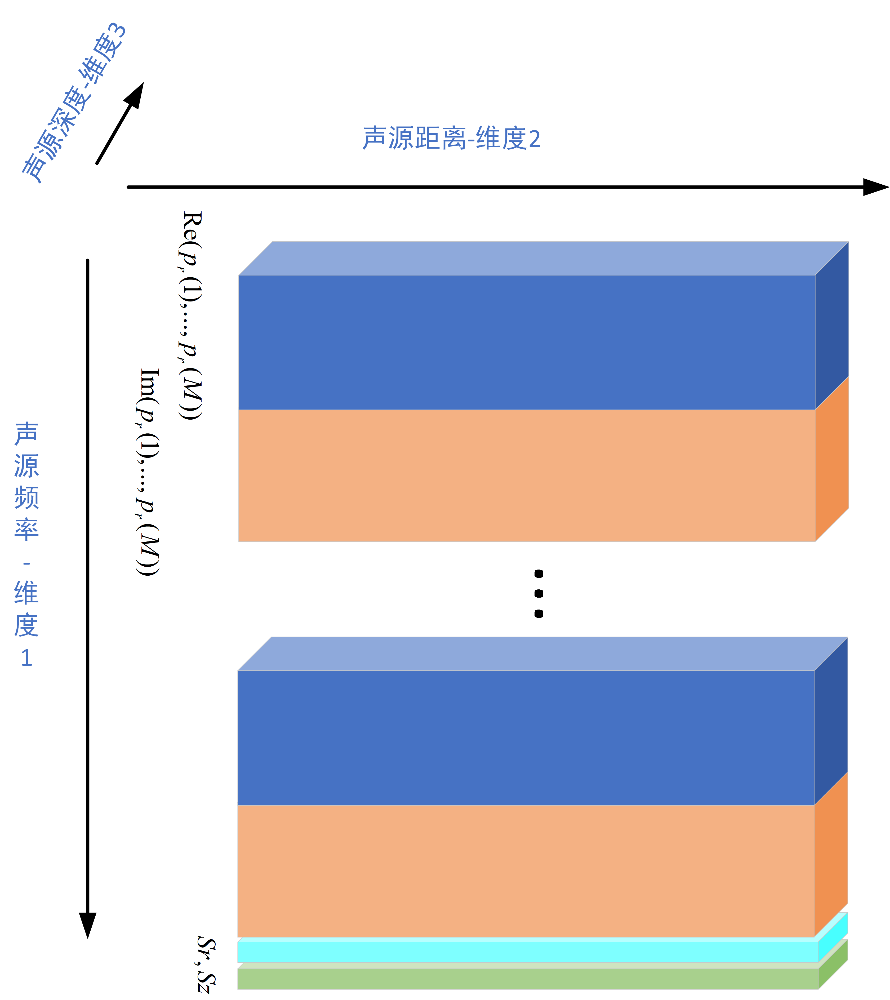
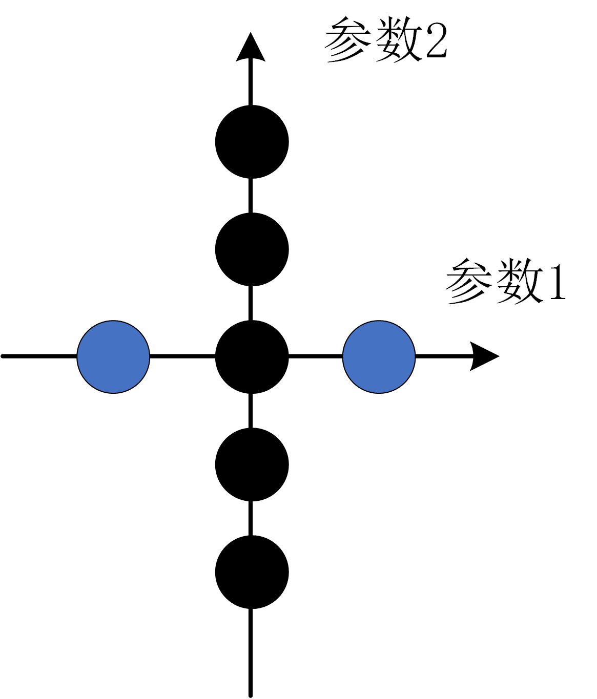
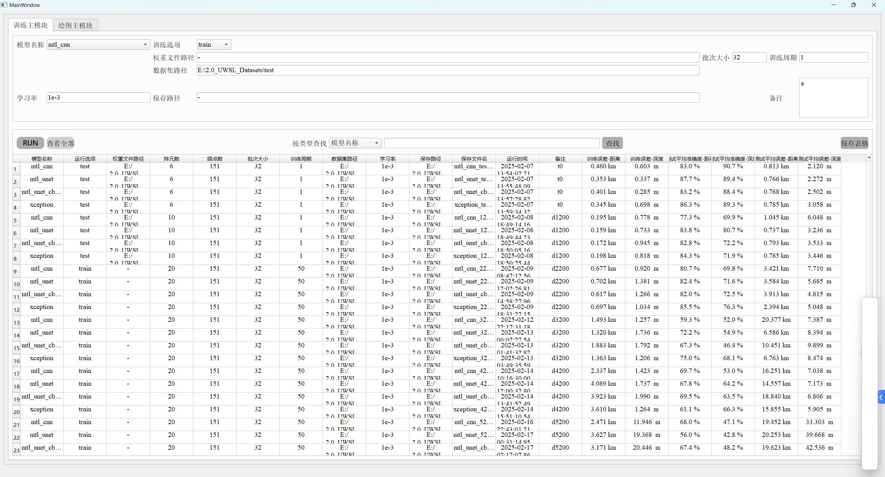
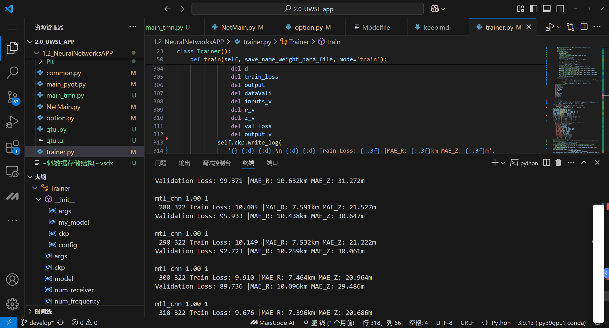
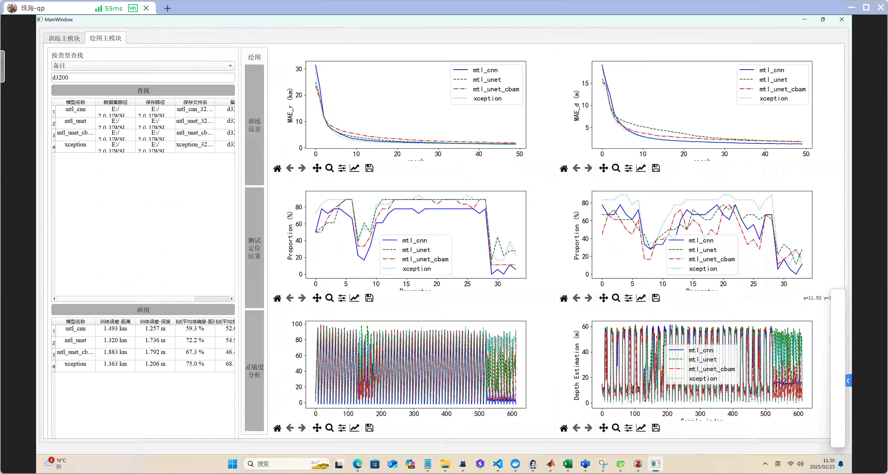

[中文](README.md) | [English](README-en.md)

# UWSL-APP

## Introduction
The Underwater Sound Source Localization APP based on Neural Network is an APP that uses the Matlab app to generate the dataset and uses the Python app to train the model for localization.
We have trained and tested on datasets with different ocean depths, and the localization results are shown in the following table:
| Model Name | Running Option | Path of the Weight File | Number of Array Elements | Number of Frequency Points | Batch Size | Training Epochs | Path of the Dataset | Learning Rate | Saving Path | Saving File Name | Running Time | Remarks | Training Error - Distance | Training Error - Depth | **Test Average Accuracy - Distance** | **Test Average Accuracy - Depth** | **Test Average Error - Distance** | **Test Average Error - Depth** | 
| --- | --- | --- | --- | --- | --- | --- | --- | --- | --- | --- | --- | --- | --- | --- | --- | --- | --- | --- |
| mtl_cnn | train | - | 6 | 151 | 32 | 50 | E:/2.0_UWSL_Datasets/test | 1e-3 | E:/2.0_UWSL_Datasets/test | mtl_cnn_test_epoch_50.00 | 2025-02-07 13:54:02.217284 | d100 | 0.460 km | 0.603  m | **83.0 %** | **90.7 %** | **0.813 km** | **2.120  m** |
| mtl_unet | train | - | 6 | 151 | 32 | 50 | E:/2.0_UWSL_Datasets/test | 1e-3 | E:/2.0_UWSL_Datasets/test | mtl_unet_test_epoch_50.00 | 2025-02-07 13:55:48.091595 | d100 | 0.353 km | 0.337  m | **87.7 %** | **89.4 %** | **0.766 km** | **2.272  m** |
| mtl_unet_cbam | train | - | 6 | 151 | 32 | 50 | E:/2.0_UWSL_Datasets/test | 1e-3 | E:/2.0_UWSL_Datasets/test | mtl_unet_cbam_test_epoch_50.00 | 2025-02-07 13:57:28.823126 | d100 | 0.401 km | 0.285  m | **83.2 %** | **88.4 %** | **0.768 km** | **2.502  m** |
| xception | train | - | 6 | 151 | 32 | 50 | E:/2.0_UWSL_Datasets/test | 1e-3 | E:/2.0_UWSL_Datasets/test | xception_test_epoch_50.00 | 2025-02-07 13:59:34.321049 | d100 | 0.345 km | 0.698  m | **86.3 %** | **89.3 %** | **0.785 km** | **3.058  m** |
| mtl_cnn | train | - | 10 | 151 | 32 | 50 | E:/2.0_UWSL_Datasets/1200m | 1e-3 | E:/2.0_UWSL_Datasets/1200m | mtl_cnn_1200m_epoch_50.00 | 2025-02-08 18:49:14.167180 | d1200 | 0.195 km | 0.778  m | **77.3 %** | **69.9 %** | **1.045 km** | **6.048  m** |
| mtl_unet | train | - | 10 | 151 | 32 | 50 | E:/2.0_UWSL_Datasets/1200m | 1e-3 | E:/2.0_UWSL_Datasets/1200m | mtl_unet_1200m_epoch_50.00 | 2025-02-08 18:49:44.237236 | d1200 | 0.159 km | 0.733  m | **83.8 %** | **80.7 %** | **0.737 km** | **3.236  m** |
| mtl_unet_cbam | train | - | 10 | 151 | 32 | 50 | E:/2.0_UWSL_Datasets/1200m | 1e-3 | E:/2.0_UWSL_Datasets/1200m | mtl_unet_cbam_1200m_epoch_50.00 | 2025-02-08 18:50:05.161912 | d1200 | 0.172 km | 0.945  m | **82.8 %** | **72.2 %** | **0.793 km** | **3.533  m** |
| xception | train | - | 10 | 151 | 32 | 50 | E:/2.0_UWSL_Datasets/1200m | 1e-3 | E:/2.0_UWSL_Datasets/1200m | xception_1200m_epoch_50.00 | 2025-02-08 18:50:25.447641 | d1200 | 0.198 km | 0.818  m | **84.3 %** | **71.9 %** | **0.785 km** | **3.446  m** |
| mtl_cnn | train | - | 20 | 151 | 32 | 50 | E:/2.0_UWSL_Datasets/2200m | 1e-3 | E:/2.0_UWSL_Datasets/2200m | mtl_cnn_2200m_epoch_50.00 | 2025-02-09 08:47:12.563411 | d2200 | 0.677 km | 0.920  m | **80.7 %** | **69.8 %** | **3.421 km** | **7.710  m** |
| mtl_unet | train | - | 20 | 151 | 32 | 50 | E:/2.0_UWSL_Datasets/2200m | 1e-3 | E:/2.0_UWSL_Datasets/2200m | mtl_unet_2200m_epoch_50.00 | 2025-02-09 12:02:26.813284 | d2200 | 0.702 km | 1.381  m | **82.4 %** | **71.6 %** | **3.584 km** | **5.685  m** |
| mtl_unet_cbam | train | - | 20 | 151 | 32 | 50 | E:/2.0_UWSL_Datasets/2200m | 1e-3 | E:/2.0_UWSL_Datasets/2200m | mtl_unet_cbam_2200m_epoch_50.00 | 2025-02-09 14:58:27.968796 | d2200 | 0.617 km | 1.266  m | **82.0 %** | **72.5 %** | **3.913 km** | **4.815  m** |
| xception | train | - | 20 | 151 | 32 | 50 | E:/2.0_UWSL_Datasets/2200m | 1e-3 | E:/2.0_UWSL_Datasets/2200m | xception_2200m_epoch_50.00 | 2025-02-09 18:31:22.151742 | d2200 | 0.697 km | 1.034  m | **85.5 %** | **76.3 %** | **2.394 km** | **5.048  m** |
| mtl_cnn | train | - | 20 | 151 | 32 | 50 | E:/2.0_UWSL_Datasets/3200m | 1e-3 | E:/2.0_UWSL_Datasets/3200m | mtl_cnn_3200m_epoch_50.00 | 2025-02-12 22:17:31.182308 | d3200 | 1.493 km | 1.257  m | **59.3 %** | **52.0 %** | **20.377 km** | **7.387  m** |
| mtl_unet | train | - | 20 | 151 | 32 | 50 | E:/2.0_UWSL_Datasets/3200m | 1e-3 | E:/2.0_UWSL_Datasets/3200m | mtl_unet_3200m_epoch_50.00 | 2025-02-13 00:02:27.549943 | d3200 | 1.320 km | 1.736  m | **72.2 %** | **54.9 %** | **6.586 km** | **8.394  m** |
| mtl_unet_cbam | train | - | 20 | 151 | 32 | 50 | E:/2.0_UWSL_Datasets/3200m | 1e-3 | E:/2.0_UWSL_Datasets/3200m | mtl_unet_cbam_3200m_epoch_50.00 | 2025-02-13 01:41:32.826449 | d3200 | 1.883 km | 1.792  m | **67.3 %** | **46.4 %** | **10.451 km** | **9.899  m** |
| xception | train | - | 20 | 151 | 32 | 50 | E:/2.0_UWSL_Datasets/3200m | 1e-3 | E:/2.0_UWSL_Datasets/3200m | xception_3200m_epoch_50.00 | 2025-02-13 03:49:35.596722 | d3200 | 1.363 km | 1.206  m | **75.0 %** | **68.1 %** | **6.763 km** | **8.474  m** |
| mtl_cnn | train | - | 20 | 151 | 32 | 50 | E:/2.0_UWSL_Datasets/4200m | 1e-3 | E:/2.0_UWSL_Datasets/4200m | mtl_cnn_4200m_epoch_50.00 | 2025-02-14 10:16:30.001760 | d4200 | 2.337 km | 1.423  m | **69.7 %** | **53.0 %** | **16.251 km** | **7.038  m** |
| mtl_unet | train | - | 20 | 151 | 32 | 50 | E:/2.0_UWSL_Datasets/4200m | 1e-3 | E:/2.0_UWSL_Datasets/4200m | mtl_unet_4200m_epoch_50.00 | 2025-02-14 12:00:32.803864 | d4200 | 4.089 km | 1.737  m | **67.8 %** | **64.2 %** | **14.557 km** | **7.173  m** |
| mtl_unet_cbam | train | - | 20 | 151 | 32 | 50 | E:/2.0_UWSL_Datasets/4200m | 1e-3 | E:/2.0_UWSL_Datasets/4200m | mtl_unet_cbam_4200m_epoch_50.00 | 2025-02-14 13:41:52.492001 | d4200 | 3.923 km | 1.990  m | **69.5 %** | **63.5 %** | **18.840 km** | **6.806  m** |
| xception | train | - | 20 | 151 | 32 | 50 | E:/2.0_UWSL_Datasets/4200m | 1e-3 | E:/2.0_UWSL_Datasets/4200m | xception_4200m_epoch_50.00 | 2025-02-14 15:51:10.544488 | d4200 | 3.610 km | 1.264  m | **61.1 %** | **66.3 %** | **15.855 km** | **5.905  m** |
| mtl_cnn | train | - | 20 | 151 | 32 | 50 | E:/2.0_UWSL_Datasets/5200m | 1e-3 | E:/2.0_UWSL_Datasets/5200m | mtl_cnn_5200m_epoch_50.00 | 2025-02-16 22:43:01.217414 | d5200 | 2.471 km | 11.946  m | **68.0 %** | **47.1 %** | **19.452 km** | **33.303  m** |
| mtl_unet | train | - | 20 | 151 | 32 | 50 | E:/2.0_UWSL_Datasets/5200m | 1e-3 | E:/2.0_UWSL_Datasets/5200m | mtl_unet_5200m_epoch_50.00 | 2025-02-17 00:31:14.955910 | d5200 | 3.627 km | 19.368  m | **56.0 %** | **42.8 %** | **20.253 km** | **39.668  m** |
| mtl_unet_cbam | train | - | 20 | 151 | 32 | 50 | E:/2.0_UWSL_Datasets/5200m | 1e-3 | E:/2.0_UWSL_Datasets/5200m | mtl_unet_cbam_5200m_epoch_50.00 | 2025-02-17 02:17:07.864130 | d5200 | 3.171 km | 20.446  m | **67.4 %** | **48.2 %** | **19.623 km** | **42.536  m** |
| xception | train | - | 20 | 151 | 32 | 50 | E:/2.0_UWSL_Datasets/5200m | 1e - 3 | E:/2.0_UWSL_Datasets/5200m | xception_5200m_epoch_50.00 | 2025-02-17 04:30:12.104141 | d5200 | 2.171 km | 15.461  m | **77.3 %** | **37.3 %** | **15.300 km** | **39.715  m** |
| mtl_cnn | train | - | 20 | 151 | 32 | 100 | E:/2.0_UWSL_Datasets/6200m | 2e - 3 | E:/2.0_UWSL_Datasets/6200m | mtl_cnn_6200m_epoch_100.00 | 2025-02-17 21:52:43.418065 | d6200 | 2.760 km | 14.233  m | **75.1 %** | **67.6 %** | **13.186 km** | **31.518  m** |
| mtl_unet | train | - | 20 | 151 | 32 | 100 | E:/2.0_UWSL_Datasets/6200m | 2e - 3 | E:/2.0_UWSL_Datasets/6200m | mtl_unet_6200m_epoch_100.00 | 2025-02-18 01:18:35.626580 | d6200 | 2.535 km | 35.213  m | **70.8 %** | **61.8 %** | **18.272 km** | **35.456  m** |
| mtl_unet_cbam | train | - | 20 | 151 | 32 | 100 | E:/2.0_UWSL_Datasets/6200m | 2e - 3 | E:/2.0_UWSL_Datasets/6200m | mtl_unet_cbam_6200m_epoch_100.00 | 2025-02-18 04:36:23.284802 | d6200 | 3.087 km | 46.785  m | **63.3 %** | **31.7 %** | **22.812 km** | **75.593  m** |
| xception | train | - | 20 | 151 | 32 | 100 | E:/2.0_UWSL_Datasets/6200m | 2e - 3 | E:/2.0_UWSL_Datasets/6200m | xception_6200m_epoch_100.00 | 2025-02-18 09:30:36.380418 | d6200 | 2.563 km | 27.303  m | **76.3 %** | **76.8 %** | **17.136 km** | **23.333  m** |


The correct rate of localization as the ocean depth (ranging from 100 to 6000m) changes is shown in the above figure. It can be seen that the deeper the ocean depth, the lower the correct rate of localization, indicating that it is more difficult to localize in the deep sea. Among the four models, the Xception model has the highest average correct rate, while the mtl_unet_cbam model has the lowest average correct rate.
The radar capability diagrams of the four models for distance and depth at different ocean depths are shown in the following figure.

## Software Architecture
The overall software architecture of the UWSL - APP is mainly divided into two major parts: data generation and neural network application. Each part has a clear division of labor and interacts through files and configurations. The following is a detailed architectural description:

1. Root Directory Files
- **Configuration and Log Files**
    - `config.txt`: Stores the general configuration information of the entire project.
    - `log.txt`: Records the logs during the project operation, which is convenient for debugging and monitoring.
- **Data and Document Files**
    - `infos.db`: Stores important data related to the project.
    - `数据存储结构.vsdx`: A design document that shows the data storage structure in Visio format.
    - `数据集构建.png`: Intuitively presents the dataset construction process.
- **Project Description Files**
    - `folder_structure.txt`: Records the project folder structure.
    - `README.md`: The project description document, including the overview, usage methods, and other contents.

2. 1.1_DataGenerationAPP (Underwater Sound Field Data Generation Application)
This module is developed using MATLAB and is responsible for data generation and configuration management.
- **Main Directory Files**
    - `config.json`: The configuration file of this module, containing data generation parameters.
    - `FunSWDataSim.asv` and `FunSWDataSim.m`: MATLAB scripts for data simulation.
    - `TableDataApp.mlapp` and `TableDataApp_exported.m`: MATLAB programs and exported scripts related to the table data application.
- **1.1.0_SettingTables (Setting Table Submodule)**
    - Multiple `.xlsx` files (such as `1000M.xlsx` - `6200M.xlsx`) store data settings of different scales or parameters.
    - `Parameters.xlsx` and `Parameters_zh.xlsx`: Parameter information files in English and Chinese respectively.
    - `setting.json`: The specific configuration file of this submodule.
    - `test.xlsx`: A data file for testing.
- **1.1.1_EnvBaseDataSet (Environmental Basic Dataset Submodule)**
    - `rd.txt`, `ssp.txt` and `ssp_pek.txt`: Store environmental basic data.
- **dependencies (Dependency Submodule)**
    - Multiple `.exe` and `.m` files (such as `bellhop.exe`, `bellhop.m`, etc.) are external tools and MATLAB scripts on which data generation depends.

3. 1.2_NeuralNetworksAPP (Neural Network Application)
This module is developed using Python and is responsible for the training and application of neural network models.
- **Main Directory Files**
    - `common.py`: Contains common functions and classes of the project.
    - `main_pyqt.py` and `main_tmn.py`: The main running scripts of the project, implementing interface interaction using PyQt.
    - `NetMain.py`: The main control script of the neural network.
    - `option.py`: Handles the configuration options of the neural network.
    - `qtui.py` and `qtui.ui`: Files related to the PyQt interface design.
    - `trainer.py`: Responsible for the training of the neural network model.
- **data (Data Submodule)**
    - Multiple `.py` files (such as `Dataloader.py`, `Dataloader22.py`, etc.) are used for data loading and processing.
    - `Read and visualize data-Copy1.ipynb`, `Read and visualize data.html` and `Read and visualize data.ipynb`: Jupyter Notebook files for data reading and visualization.
    - `__init__.py`: Makes this directory a Python package.
- **model (Model Submodule)**
    - Multiple `.py` files (such as `CMFP.py`, `mtl_cnn.py`, etc.) define different neural network models.
    - `__init__.py`: Makes this directory a Python package.
- **Plt (Plotting Submodule)**
    - `beaplot.py`: A Python script for drawing relevant charts. 

## Installation Tutorial

1. Hardware Preparation
Ensure that you have a host computer equipped with a GPU and that the CUDA environment has been installed. If CUDA has not been installed yet, you can follow these steps:
- **Check GPU Compatibility**: Visit the official NVIDIA website to confirm that your GPU supports the required CUDA version.
- **Download the CUDA Toolkit**: Download the CUDA Toolkit installation package suitable for your operating system and GPU from the official NVIDIA website.
- **Install the CUDA Toolkit**: Run the downloaded installation package and complete the installation following the prompts of the installation wizard. During the installation, you can choose the custom installation option and install CUDA tools, drivers, and other components as needed.
- **Verify the Installation**: After the installation is complete, open the command-line tool and enter the command `nvcc --version`. If the CUDA version information can be displayed, it means the installation was successful.

2. Preparation of the Data Generation Code Environment (Windows System)
The data generation code requires MATLAB version 2021+ to be installed on the Windows system. Follow these steps to install it:
- **Download MATLAB**: Visit the official MathWorks website and download the installation package of MATLAB R2021 or a higher version.
- **Install MATLAB**: Run the downloaded installation package and complete the installation following the prompts of the installation wizard. During the installation, you can select the toolboxes you need to install. It is recommended to install at least the Signal Processing Toolbox, Neural Network Toolbox, and other related toolboxes.
- **Activate MATLAB**: After the installation is complete, activate the MATLAB software according to the prompts. You can use your MathWorks account for online activation or use a license file for offline activation.

3. Preparation of the Network Training Code Environment
The network training code requires Python version 3.9 and the necessary dependencies to be installed via `pip`. Follow these steps:

**Download and Install Anaconda (Recommended)**
Anaconda is a distribution that includes Python and numerous scientific computing libraries, and it also provides the convenient virtual environment management tool `conda`.
    1. Visit the [Anaconda official download page](https://www.anaconda.com/products/distribution).
    2. Select the Anaconda installation package suitable for your system for download.
    3. Run the downloaded installation package and complete the installation following the prompts of the installation wizard. During the installation, it is recommended to check the option "Add Anaconda3 to my PATH environment variable" so that you can conveniently use the `conda` command in the command line.
- **Linux Terminal**:
    1. Open the terminal and use the `wget` command to download the Anaconda installation script:
    ```bash
    wget https://repo.anaconda.com/archive/Anaconda3-202x.xx-Linux-x86_64.sh  # Replace with the latest version number
    ```
    2. Run the downloaded installation script:
    ```bash
    bash Anaconda3-202x.xx-Linux-x86_64.sh  # Replace with the actual downloaded file name
    ```

**Create a Virtual Environment (Optional but Recommended)**
To avoid dependency conflicts between different projects, it is recommended to use a virtual environment. You can use `venv` or `conda` to create a virtual environment.
Create a virtual environment using `venv`:

- **Create a virtual environment using `conda`**:
```bash
conda create -n uwslapp python=3.9
conda activate uwslapp
```
- **Create a virtual environment using `venv`**:
```bash
python3.9 -m venv uwslapp
source uwslapp/bin/activate  # For Linux/macOS
uwslapp\Scripts\activate  # For Windows
```

- **Install Dependencies**:
Enter the root directory of the project and use the following command to install all the dependencies listed in `requirements.txt`:
```bash
pip install -r requirements.txt
```

4. Verify the Installation
After completing the above steps, you can try running the data generation code and the network training code in the project to verify whether the installation was successful. If you encounter any problems, you can troubleshoot and solve them according to the error messages.

Through the above steps, you should be able to successfully install and configure the hardware and software environment required by the project. If you encounter any problems during the installation process, please refer to the official documentation of the relevant software or seek community support. 

## Usage Instructions

1. 1.1_DataGenerationAPP (Underwater Sound Field Data Generation Application)

    (1). Run `TableDataApp.mlapp` using MATLAB to open the application interface.


    (2). Configure the sound speed profile, receiver array depth, sound source distance, sound source depth, frequency band, bottom sound speed, density, absorption, etc. on the interface.
    - **Parameter Table Settings**

    | Parameter | Unit | Lower Limit | Upper Limit | Number of Values |
    | --- | --- | --- | --- | --- |
    | Frequency | Hz | 50 | 200 | 151 |
    | Training Set | - | 0 | 0 | 0 |
    | Sound Source Distance | km | 1 | 20 | 191 |
    | Sound Source Depth | m | 2 | 60 | 30 |
    | Sea Water Depth | m | 90 | 110 | 5 |
    | Bottom Compressional Wave Speed | m/s | 1600 | 1800 | 3 |
    | Bottom Density | g/cm^3 | 1.4 | 1.6 | 3 |
    | Bottom Compressional Wave Attenuation | dB/λ | 0.05 | 0.05 | 1 |
    | Test Set | - | 0 | 0 | 0 |
    | Sound Source Distance | km | 0.9 | 20.1 | 9 |
    | Sound Source Depth | m | 11 | 55.1 | 2 |
    | Sea Water Depth | m | 80.1 | 119.9 | 15 |
    | Bottom Compressional Wave Speed | m/s | 1511 | 1889 | 15 |
    | Bottom Density | g/cm^3 | 1.2 | 1.8 | 6 |
    | Bottom Compressional Wave Attenuation | dB/λ | 0.05 | 0.05 | 1 |

    This table determines the parameter ranges and quantities of the training set and the test set. The sound pressures related to the sound source distance, depth, frequency, and array depth are all in the same file.

The dataset is generated using the central point method, with a uniform distribution and uniform intervals. Only the **environmental** parameters determine the final number of generated files. For the training set in the above table, the final number of generated files is: 5 (sea water depth) + 3 (bottom compressional wave speed) + 3 (bottom density) - 2 (central points) = 9 files.

All `.sim` files that meet the following code can be used as the dataset. Therefore, the user can customize this dataset. Note that the user can directly copy their own `.sim` file to the A.TrainingSet or B.TestSet folder, or the user can create these two folders by themselves and create config.json in the parent directory.
```matlab
        fid = fopen(filepath,'wb+'); % Create a binary file
        % Write pressure to the binary file
        for isd = 1: length(Pos.r.z)                        % Source depth circulation
            for isr = 1: length(Pos.r.range)                % Source range circulation
                for ifreq = 1 :length(Pos.freqvec)          % Source frequency circulation
                    pr = reshape(squeeze(pressure(ifreq,:,isd,isr)).',[],1); % Take out the array received sound pressure from the data
                    pr2 = sqrt(pr' * pr);
                    if pr2 == 0
                        pr2 = 1;
                    end
                    pr_nor = pr/ pr2;            % N2 normalized
                    fwrite(fid, real(pr_nor),'float32');    % Write real part pressure
                    fwrite(fid, imag(pr_nor),'float32');    % Write image part pressure
                end
                fwrite(fid, Pos.r.range(isr),'float32');    % Write Source range
                fwrite(fid, Pos.r.z(isd),'float32');        % Write Source depth
            end
        end

        fclose(fid); % Close the binary file
```
The config.json contains parameters such as frequency, sound source distance in the training set, sound source depth, etc. Among them, the frequency, sound source distance in the training set, sound source depth, sound source distance in the test set, sound source depth, and receiver depth are essential.
```json
        {
      "Frequency": {
        "Unit": "Hz",
        "LowerLimit": 50,
        "UpperLimit": 200,
        "NumValues": 151
      },
      "trainset": {
        "SourceRange": {
          "Unit": "km",
          "LowerLimit": 1,
          "UpperLimit": 20,
          "NumValues": 191
        },
        "SourceDepth": {
          "Unit": "m",
          "LowerLimit": 2,
          "UpperLimit": 60,
          "NumValues": 30
        },
        "SeaWater": {
          "Unit": "m",
          "LowerLimit": 90,
          "UpperLimit": 110,
          "NumValues": 5
        },
        "BathPw_Speed": {
          "Unit": "m/s",
          "LowerLimit": 1600,
          "UpperLimit": 1800,
          "NumValues": 3
        },
        "BathRho": {
          "Unit": "g⁄cm^3",
          "LowerLimit": 1.4,
          "UpperLimit": 1.6,
          "NumValues": 3
        },
        "BathPw_Atten": {
          "Unit": "dB/λ",
          "LowerLimit": 0.05,
          "UpperLimit": 0.05,
          "NumValues": 1
        }
      },
      "testset": {
        "SourceRange": {
          "Unit": "km",
          "LowerLimit": 1,
          "UpperLimit": 20,
          "NumValues": 191
        },
        "SourceDepth": {
          "Unit": "m",
          "LowerLimit": 10,
          "UpperLimit": 60,
          "NumValues": 6
        },
        "SeaWater": {
          "Unit": "m",
          "LowerLimit": 80.1,
          "UpperLimit": 119.9,
          "NumValues": 15
        },
        "BathPw_Speed": {
          "Unit": "m/s",
          "LowerLimit": 1511,
          "UpperLimit": 1889,
          "NumValues": 15
        },
        "BathRho": {
          "Unit": "g⁄cm^3",
          "LowerLimit": 1.2,
          "UpperLimit": 1.8,
          "NumValues": 6
        },
        "BathPw_Atten": {
          "Unit": "dB⁄λ",
          "LowerLimit": 0.05,
          "UpperLimit": 0.05,
          "NumValues": 1
        }
      },
      "ReceiverDepth": [
        10,
        20,
        30,
        40,
        50,
        60
      ],
      "SoundSpeedProfile": [
        [
          0,
          1548.52
        ],
    ...
        [
          5000,
          1551.91
        ]
      ]
    }
```
    - **Model Settings**
    Currently available models are Kraken (normal mode), Bellhop model (ray), and the RAM model (parabolic equation) is yet to be developed.
    - **Array Settings**
    Currently, only vertical arrays are supported, including the setting of the number of array elements (Num of Receiver) and the setting of the receiver depth (Receiver Depth). The receiver depth setting supports the setting of the start and end values, and the equal-interval interpolation is directly carried out according to the number of array elements.
    - **Sound Speed Profile Settings**
    In the setting of the sound speed profile, the first column is the depth (m), and the second column is the sound speed (m/s), separated by a space. For example:
    ```text
        0.0  1548.52  
    200.0  1530.29  
    ...    ...
    5000.0  1551.91  
    ```
    Please ensure that the depth of the sound speed profile starts from 0 and increases strictly. If the layering of the sound speed profile is too fine (usually more than 200 lines), please first interpolate it to a coarser grid. The maximum depth must be greater than the sea water depth of the training and test sets.

    (3) Click the "Run&Save" button, select the path of the generated folder, and start the data simulation.
    

2. 1.2_NeuralNetworksAPP (Neural Network Application)

    (1). Run `main_pyqt.py` to open the application interface.
    Run it using the terminal:

    ```bash
    cd 2.0_UWSL_APP
    python.\1.2_NeuralNetworksAPP\main_pyqt.py
    ```

    
    (2). Select the configured neural network model and parameters on the interface, including parameters such as the network name, dataset path, learning rate, running mode, number of training epochs, etc.
    - **Models** include
        - mtl_cnn (Liu Y, Niu H, Li Z. A multi-task learning convolutional neural network for source localization in deep ocean. The Journal of the Acoustical Society of America 2020;148:873–83. https://doi.org/10.1121/10.0001762.)
        - mtl_unet (P. Qian, W. Gan, H. Niu, G. Ji, Z. Li, G. Li, A feature-compressed multi-task learning U-Net for shallow-water source localization in the presence of internal waves, Applied Acoustics 211 (2023) 109530. https://doi.org/10.1016/j.apacoust.2023.109530.)
        - mtl_unet_cbam (P. Qian, W. Gan, H. Niu, G. Ji, Z. Li, G. Li, A feature-compressed multi-task learning U-Net for shallow-water source localization in the presence of internal waves, Applied Acoustics 211 (2023) 109530. https://doi.org/10.1016/j.apacoust.2023.109530.)
        - xception (Chollet F. Xception: Deep Learning with Depthwise Separable Convolutions. arXiv E-Prints 2016:arXiv:1610.02357. https://doi.org/10.48550/arXiv.1610.02357. Adapted for underwater localization)

    \~all~ represents running all models with the same parameters.
    
    You are welcome to create your own model! Similar to MTL_CNN, the input of your network is (Batchsize, Nfreq*2, Num_receiver, Num_receiver), that is, the covariance matrix with the real and imaginary parts of the broadband separated, and the output can be the distance and depth.
```python
class MultiTaskLossWrapper(nn.Module):
    def __init__(self, task_num, input_channels):
        super(MultiTaskLossWrapper, self).__init__()
        self.model = MTL_CNN(input_channels=input_channels)
        self.task_num = task_num
        self.log_vars2 = nn.Parameter(torch.zeros(task_num))

    def forward(self, input_feature, target):
        outputs = self.model(input_feature)

        precision1 = torch.exp(-self.log_vars2[0])
        precision2 = torch.exp(-self.log_vars2[1])
        mtl_loss = torch.sum(0.5 * precision1 * (target[0] - outputs[0]) ** 2., -1) + \
                   torch.sum(0.5 * precision2 * (target[1] - outputs[1]) ** 2., -1) + \
                   0.5 * self.log_vars2[0] + 0.5 * self.log_vars2[1]

        return mtl_loss, self.log_vars2.data.tolist(), outputs


if __name__ == '__main__':

    mtl = MultiTaskLossWrapper(2, 151*2)
    inputs = torch.randn(5, 151 * 2, 18, 18)
    r = torch.rand(5)
    z = torch.rand(5)
    targets = [r, z]
    loss, log_vars2, output = mtl(inputs, [r, z])
    print(loss, log_vars2, output)

```
    Or you can use the input of MTL_UNET, which vectorizes the covariance matrix into (Batchsize, 1, Nfreq*2, Num_receiver* Num_receiver), and the output is still the distance and depth.
```python
    class MultiTaskLossWrapper(nn.Module):
    def __init__(self, in_channel, task_num):
        super(MultiTaskLossWrapper, self).__init__()
        self.model = Local(in_channel, in_channels=16)
        self.task_num = task_num
        self.log_vars2 = nn.Parameter(torch.zeros(task_num))

    def forward(self, input_feature, target):
        outputs = self.model(input_feature)
        precision1 = torch.exp(-self.log_vars2[0])
        precision2 = torch.exp(-self.log_vars2[1])
        mtl_loss = torch.sum(0.5 * precision1 * (target[0] - outputs[0]) ** 2., -1) + \
                   torch.sum(0.5 * precision2 * (target[1] - outputs[1]) ** 2., -1) + \
                   0.5 * self.log_vars2[0] + 0.5 * self.log_vars2[1]

        return mtl_loss, self.log_vars2.data.tolist(), outputs


if __name__ == '__main__':
    length_freq = 151
    mtl = MultiTaskLossWrapper(1, 2)

    inputs = torch.randn(5, 1, length_freq * 2, 18 * 18)
    r = torch.rand(5)
    z = torch.rand(5)
    targets = [r, z]
    loss, log_vars2, output = mtl(inputs, [r, z])
    print(loss, log_vars2, output)

```
    - **Training Options** include
    train: Train the model and conduct synchronous testing
    test: Test the model
    resume: Resume training the model (the path of the weight file needs to be specified, and only a single model can be called, and \~all~ cannot be selected)
    - **Batch Size**
    Specify the batch size during training and testing, generally 32.
    - **Number of Training Epochs**
    Specify the number of training epochs.
    - **Learning Rate**
    Specify the learning rate for training.
    - **Path of the Weight File**
    The path of the base weight file for resuming the training of the model.
    - **Dataset Path**
    The path of the dataset folder, which is the root directory selected when running the data generation APP. For example, E:\2.0_UWSL_Datasets\100M, and the path contains folders such as A.TrainingSet and B.TestSet.
    - **Saving Path**
    The saving path of the model training results. When it is '-', it means the same as the dataset path. For example, in the dataset path E:\2.0_UWSL_Datasets\100M, the model weight folder a.weight_parameter, the training result folder b.training_results, etc. are saved.
    - **Remarks**
    Used to make remarks and explanations for this task, generally used for screening and drawing.
    (3). Click the "Run" button to start the model training.
    You can see the current training loss in the terminal, and the model weights and training results will be saved during the training process.
    
    (4). Click Tab 2, select "Remarks" according to the type search, click the Search button, and click "Draw" to view the training results.
    
3. Call the Neural Network Training with Hyperparameters Using the Terminal
```bash
cd 2.0_UWSL_APP
python.\1.2_NeuralNetworksAPP\main_tmn.py --model mtl_unet --data_loader_path E:\2.0_UWSL_Datasets\test --lr 0.001  --epoch 100 --batch_size 32 --save_file '-'
```
- **Parameter Explanation**
    - `--model`: Select the model, including mtl_cnn, mtl_unet, mtl_unet_cbam, xception.
    - `--data_loader_path`: The path of the dataset, which is the root directory selected when running the data generation APP, such as E:\2.0_UWSL_Datasets\100M.
    - `--lr`: The learning rate.
    - `--epoch`: The number of training epochs.
    - `--batch_size`: The batch size.
    - `--save_file`: The saving path. When it is '-', it is the same as the dataset path.
    For other parameters, please refer to option.py and trainer.py.

## Contribute

UWSL-APP is an open-source project, and you are welcome to contribute. You can contribute in the following ways:

1. Submit issues and suggestions: If you encounter any problems or have any suggestions during the use of UWSL-APP, please submit an Issue on Gitee.
2. Submit code: If you have any ideas for code improvement or new features, please submit them via a Pull Request. 