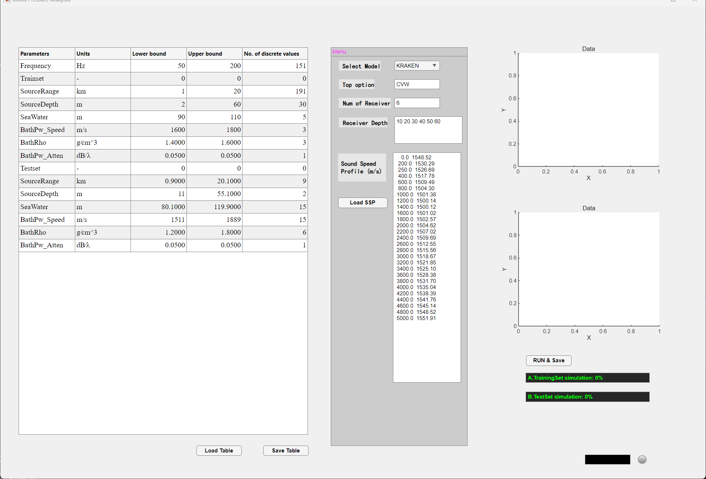
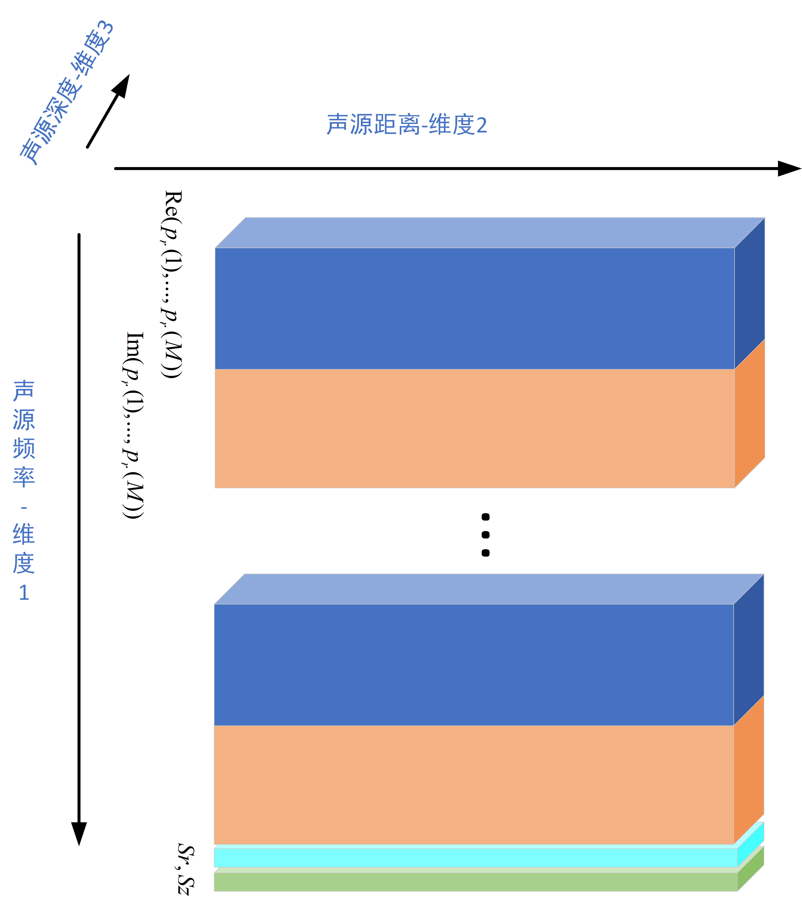
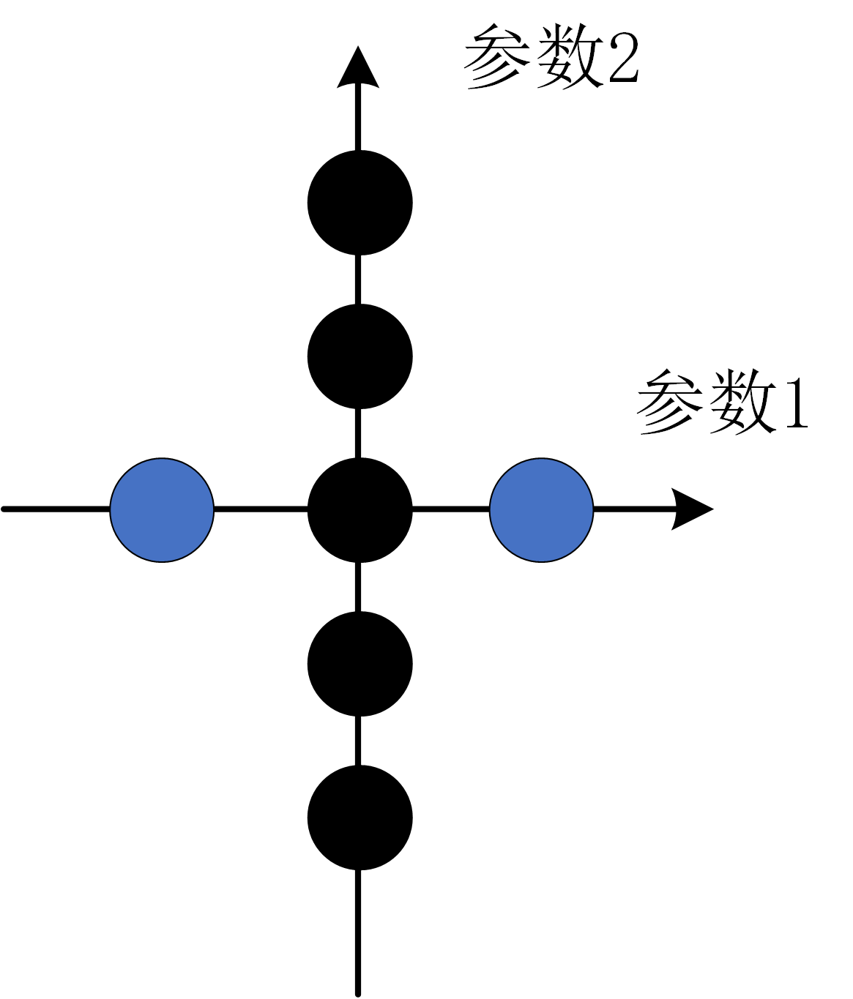
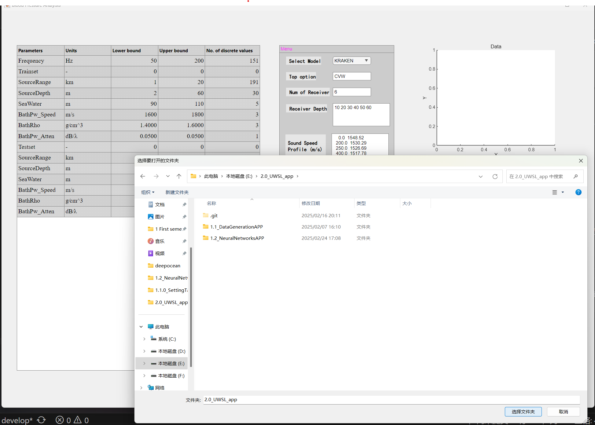
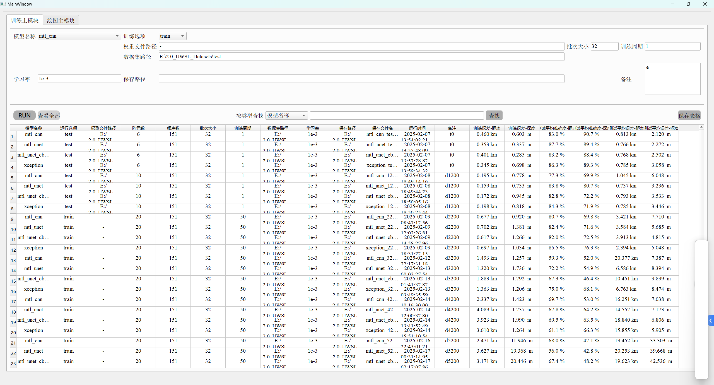
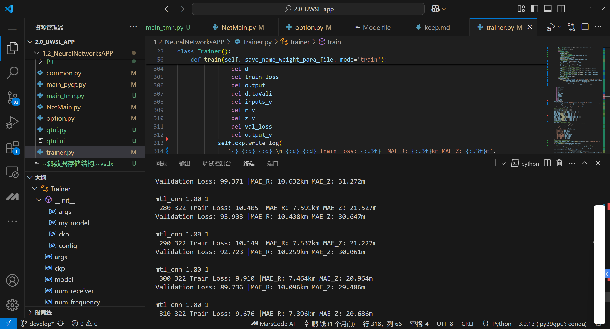
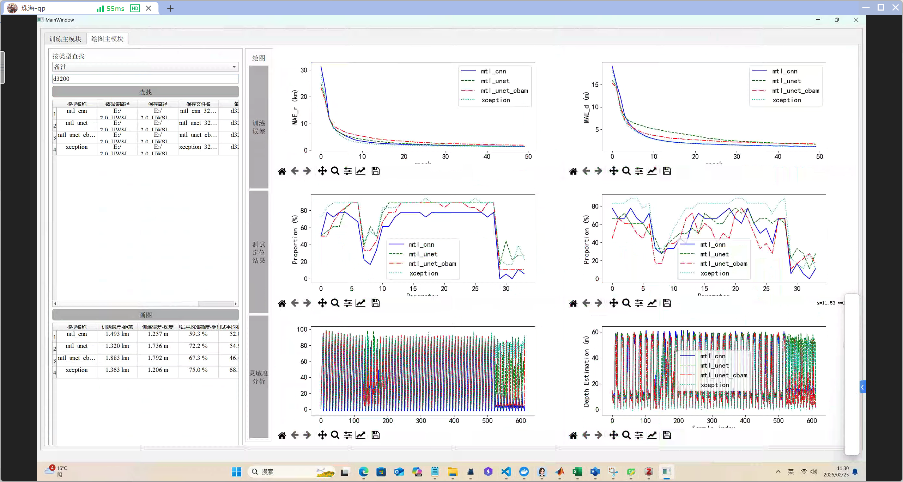

[中文](README-zh.md) | [English](README-en.md)

# UWSL-APP

## 介绍
神经网络水下声源定位APP是一个使用matlab app生成数据集，使用python app训练模型进行定位的APP。
我们在不同海深的数据集上进行了训练和测试，定位结果如下表所示
| 模型名称 | 运行选项 | 权重文件路径 | 阵元数 | 频点数 | 批次大小 | 训练周期 | 数据集路径 | 学习率 | 保存路径 | 保存文件名 | 运行时间 | 备注 | 训练误差-距离 | 训练误差-深度 | **测试平均准确度-距离** | **测试平均准确度-深度** | **测试平均误差-距离** | **测试平均误差-深度** |
| --- | --- | --- | --- | --- | --- | --- | --- | --- | --- | --- | --- | --- | --- | --- | --- | --- | --- | --- |
| mtl_cnn | train | - | 6 | 151 | 32 | 50 | E:/2.0_UWSL_Datasets/test | 1e-3 | E:/2.0_UWSL_Datasets/test | mtl_cnn_test_epoch_50.00 | 2025-02-07 13:54:02.217284 | d100 | 0.460 km | 0.603  m | **83.0 %** | **90.7 %** | **0.813 km** | **2.120  m** |
| mtl_unet | train | - | 6 | 151 | 32 | 50 | E:/2.0_UWSL_Datasets/test | 1e-3 | E:/2.0_UWSL_Datasets/test | mtl_unet_test_epoch_50.00 | 2025-02-07 13:55:48.091595 | d100 | 0.353 km | 0.337  m | **87.7 %** | **89.4 %** | **0.766 km** | **2.272  m** |
| mtl_unet_cbam | train | - | 6 | 151 | 32 | 50 | E:/2.0_UWSL_Datasets/test | 1e-3 | E:/2.0_UWSL_Datasets/test | mtl_unet_cbam_test_epoch_50.00 | 2025-02-07 13:57:28.823126 | d100 | 0.401 km | 0.285  m | **83.2 %** | **88.4 %** | **0.768 km** | **2.502  m** |
| xception | train | - | 6 | 151 | 32 | 50 | E:/2.0_UWSL_Datasets/test | 1e-3 | E:/2.0_UWSL_Datasets/test | xception_test_epoch_50.00 | 2025-02-07 13:59:34.321049 | d100 | 0.345 km | 0.698  m | **86.3 %** | **89.3 %** | **0.785 km** | **3.058  m** |
| mtl_cnn | train | - | 10 | 151 | 32 | 50 | E:/2.0_UWSL_Datasets/1200m | 1e-3 | E:/2.0_UWSL_Datasets/1200m | mtl_cnn_1200m_epoch_50.00 | 2025-02-08 18:49:14.167180 | d1200 | 0.195 km | 0.778  m | **77.3 %** | **69.9 %** | **1.045 km** | **6.048  m** |
| mtl_unet | train | - | 10 | 151 | 32 | 50 | E:/2.0_UWSL_Datasets/1200m | 1e-3 | E:/2.0_UWSL_Datasets/1200m | mtl_unet_1200m_epoch_50.00 | 2025-02-08 18:49:44.237236 | d1200 | 0.159 km | 0.733  m | **83.8 %** | **80.7 %** | **0.737 km** | **3.236  m** |
| mtl_unet_cbam | train | - | 10 | 151 | 32 | 50 | E:/2.0_UWSL_Datasets/1200m | 1e-3 | E:/2.0_UWSL_Datasets/1200m | mtl_unet_cbam_1200m_epoch_50.00 | 2025-02-08 18:50:05.161912 | d1200 | 0.172 km | 0.945  m | **82.8 %** | **72.2 %** | **0.793 km** | **3.533  m** |
| xception | train | - | 10 | 151 | 32 | 50 | E:/2.0_UWSL_Datasets/1200m | 1e-3 | E:/2.0_UWSL_Datasets/1200m | xception_1200m_epoch_50.00 | 2025-02-08 18:50:25.447641 | d1200 | 0.198 km | 0.818  m | **84.3 %** | **71.9 %** | **0.785 km** | **3.446  m** |
| mtl_cnn | train | - | 20 | 151 | 32 | 50 | E:/2.0_UWSL_Datasets/2200m | 1e-3 | E:/2.0_UWSL_Datasets/2200m | mtl_cnn_2200m_epoch_50.00 | 2025-02-09 08:47:12.563411 | d2200 | 0.677 km | 0.920  m | **80.7 %** | **69.8 %** | **3.421 km** | **7.710  m** |
| mtl_unet | train | - | 20 | 151 | 32 | 50 | E:/2.0_UWSL_Datasets/2200m | 1e-3 | E:/2.0_UWSL_Datasets/2200m | mtl_unet_2200m_epoch_50.00 | 2025-02-09 12:02:26.813284 | d2200 | 0.702 km | 1.381  m | **82.4 %** | **71.6 %** | **3.584 km** | **5.685  m** |
| mtl_unet_cbam | train | - | 20 | 151 | 32 | 50 | E:/2.0_UWSL_Datasets/2200m | 1e-3 | E:/2.0_UWSL_Datasets/2200m | mtl_unet_cbam_2200m_epoch_50.00 | 2025-02-09 14:58:27.968796 | d2200 | 0.617 km | 1.266  m | **82.0 %** | **72.5 %** | **3.913 km** | **4.815  m** |
| xception | train | - | 20 | 151 | 32 | 50 | E:/2.0_UWSL_Datasets/2200m | 1e-3 | E:/2.0_UWSL_Datasets/2200m | xception_2200m_epoch_50.00 | 2025-02-09 18:31:22.151742 | d2200 | 0.697 km | 1.034  m | **85.5 %** | **76.3 %** | **2.394 km** | **5.048  m** |
| mtl_cnn | train | - | 20 | 151 | 32 | 50 | E:/2.0_UWSL_Datasets/3200m | 1e-3 | E:/2.0_UWSL_Datasets/3200m | mtl_cnn_3200m_epoch_50.00 | 2025-02-12 22:17:31.182308 | d3200 | 1.493 km | 1.257  m | **59.3 %** | **52.0 %** | **20.377 km** | **7.387  m** |
| mtl_unet | train | - | 20 | 151 | 32 | 50 | E:/2.0_UWSL_Datasets/3200m | 1e-3 | E:/2.0_UWSL_Datasets/3200m | mtl_unet_3200m_epoch_50.00 | 2025-02-13 00:02:27.549943 | d3200 | 1.320 km | 1.736  m | **72.2 %** | **54.9 %** | **6.586 km** | **8.394  m** |
| mtl_unet_cbam | train | - | 20 | 151 | 32 | 50 | E:/2.0_UWSL_Datasets/3200m | 1e-3 | E:/2.0_UWSL_Datasets/3200m | mtl_unet_cbam_3200m_epoch_50.00 | 2025-02-13 01:41:32.826449 | d3200 | 1.883 km | 1.792  m | **67.3 %** | **46.4 %** | **10.451 km** | **9.899  m** |
| xception | train | - | 20 | 151 | 32 | 50 | E:/2.0_UWSL_Datasets/3200m | 1e-3 | E:/2.0_UWSL_Datasets/3200m | xception_3200m_epoch_50.00 | 2025-02-13 03:49:35.596722 | d3200 | 1.363 km | 1.206  m | **75.0 %** | **68.1 %** | **6.763 km** | **8.474  m** |
| mtl_cnn | train | - | 20 | 151 | 32 | 50 | E:/2.0_UWSL_Datasets/4200m | 1e-3 | E:/2.0_UWSL_Datasets/4200m | mtl_cnn_4200m_epoch_50.00 | 2025-02-14 10:16:30.001760 | d4200 | 2.337 km | 1.423  m | **69.7 %** | **53.0 %** | **16.251 km** | **7.038  m** |
| mtl_unet | train | - | 20 | 151 | 32 | 50 | E:/2.0_UWSL_Datasets/4200m | 1e-3 | E:/2.0_UWSL_Datasets/4200m | mtl_unet_4200m_epoch_50.00 | 2025-02-14 12:00:32.803864 | d4200 | 4.089 km | 1.737  m | **67.8 %** | **64.2 %** | **14.557 km** | **7.173  m** |
| mtl_unet_cbam | train | - | 20 | 151 | 32 | 50 | E:/2.0_UWSL_Datasets/4200m | 1e-3 | E:/2.0_UWSL_Datasets/4200m | mtl_unet_cbam_4200m_epoch_50.00 | 2025-02-14 13:41:52.492001 | d4200 | 3.923 km | 1.990  m | **69.5 %** | **63.5 %** | **18.840 km** | **6.806  m** |
| xception | train | - | 20 | 151 | 32 | 50 | E:/2.0_UWSL_Datasets/4200m | 1e-3 | E:/2.0_UWSL_Datasets/4200m | xception_4200m_epoch_50.00 | 2025-02-14 15:51:10.544488 | d4200 | 3.610 km | 1.264  m | **61.1 %** | **66.3 %** | **15.855 km** | **5.905  m** |
| mtl_cnn | train | - | 20 | 151 | 32 | 50 | E:/2.0_UWSL_Datasets/5200m | 1e-3 | E:/2.0_UWSL_Datasets/5200m | mtl_cnn_5200m_epoch_50.00 | 2025-02-16 22:43:01.217414 | d5200 | 2.471 km | 11.946  m | **68.0 %** | **47.1 %** | **19.452 km** | **33.303  m** |
| mtl_unet | train | - | 20 | 151 | 32 | 50 | E:/2.0_UWSL_Datasets/5200m | 1e-3 | E:/2.0_UWSL_Datasets/5200m | mtl_unet_5200m_epoch_50.00 | 2025-02-17 00:31:14.955910 | d5200 | 3.627 km | 19.368  m | **56.0 %** | **42.8 %** | **20.253 km** | **39.668  m** |
| mtl_unet_cbam | train | - | 20 | 151 | 32 | 50 | E:/2.0_UWSL_Datasets/5200m | 1e-3 | E:/2.0_UWSL_Datasets/5200m | mtl_unet_cbam_5200m_epoch_50.00 | 2025-02-17 02:17:07.864130 | d5200 | 3.171 km | 20.446  m | **67.4 %** | **48.2 %** | **19.623 km** | **42.536  m** |
| xception | train | - | 20 | 151 | 32 | 50 | E:/2.0_UWSL_Datasets/5200m | 1e - 3 | E:/2.0_UWSL_Datasets/5200m | xception_5200m_epoch_50.00 | 2025-02-17 04:30:12.104141 | d5200 | 2.171 km | 15.461  m | **77.3 %** | **37.3 %** | **15.300 km** | **39.715  m** |
| mtl_cnn | train | - | 20 | 151 | 32 | 100 | E:/2.0_UWSL_Datasets/6200m | 2e - 3 | E:/2.0_UWSL_Datasets/6200m | mtl_cnn_6200m_epoch_100.00 | 2025-02-17 21:52:43.418065 | d6200 | 2.760 km | 14.233  m | **75.1 %** | **67.6 %** | **13.186 km** | **31.518  m** |
| mtl_unet | train | - | 20 | 151 | 32 | 100 | E:/2.0_UWSL_Datasets/6200m | 2e - 3 | E:/2.0_UWSL_Datasets/6200m | mtl_unet_6200m_epoch_100.00 | 2025-02-18 01:18:35.626580 | d6200 | 2.535 km | 35.213  m | **70.8 %** | **61.8 %** | **18.272 km** | **35.456  m** |
| mtl_unet_cbam | train | - | 20 | 151 | 32 | 100 | E:/2.0_UWSL_Datasets/6200m | 2e - 3 | E:/2.0_UWSL_Datasets/6200m | mtl_unet_cbam_6200m_epoch_100.00 | 2025-02-18 04:36:23.284802 | d6200 | 3.087 km | 46.785  m | **63.3 %** | **31.7 %** | **22.812 km** | **75.593  m** |
| xception | train | - | 20 | 151 | 32 | 100 | E:/2.0_UWSL_Datasets/6200m | 2e - 3 | E:/2.0_UWSL_Datasets/6200m | xception_6200m_epoch_100.00 | 2025-02-18 09:30:36.380418 | d6200 | 2.563 km | 27.303  m | **76.3 %** | **76.8 %** | **17.136 km** | **23.333  m** |


定位的正确率随着海深（100-6000m）的变化如上图所示，可以看出，海深越深，定位正确率越低，说明深海定位的难度较大。四种模型中，xception模型的平均正确率最高，mtl_unet_cbam的平均正确率最低。
四个模型在不同海深上距离和深度的雷达能力图如下图所示。

## 软件架构
UWSL - APP 整体软件架构主要分为数据生成和神经网络应用两大部分，各部分分工明确，通过文件和配置进行交互。以下是详细的架构说明：

1. 根目录文件
- **配置与日志文件**
    - `config.txt`：存储整个项目的通用配置信息。
    - `log.txt`：记录项目运行过程中的日志，便于调试和监控。
- **数据与文档文件**
    - `infos.db`：存储项目相关的重要数据。
    - `数据存储结构.vsdx`：以 Visio 格式展示数据存储结构的设计文档。
    - `数据集构建.png`：直观呈现数据集构建过程。
- **项目说明文件**
    - `folder_structure.txt`：记录项目文件夹结构。
    - `README.md`：项目说明文档，包含概述、使用方法等内容。

2. 1.1_DataGenerationAPP（声场数据生成应用）
该模块使用 MATLAB 开发，负责数据生成和配置管理。
- **主目录文件**
    - `config.json`：该模块的配置文件，包含数据生成参数。
    - `FunSWDataSim.asv` 和 `FunSWDataSim.m`：用于数据模拟的 MATLAB 脚本。
    - `TableDataApp.mlapp` 和 `TableDataApp_exported.m`：与表格数据应用相关的 MATLAB 程序和导出脚本。
- **1.1.0_SettingTables（设置表子模块）**
    - 多个 `.xlsx` 文件（如 `1000M.xlsx` - `6200M.xlsx`）存储不同规模或参数的数据设置。
    - `Parameters.xlsx` 和 `Parameters_zh.xlsx`：分别为英文和中文的参数信息文件。
    - `setting.json`：该子模块的特定配置文件。
    - `test.xlsx`：用于测试的数据文件。
- **1.1.1_EnvBaseDataSet（环境基础数据集子模块）**
    - `rd.txt`、`ssp.txt` 和 `ssp_pek.txt`：存储环境基础数据。
- **dependencies（依赖项子模块）**
    - 多个 `.exe` 和 `.m` 文件（如 `bellhop.exe`、`bellhop.m` 等）是数据生成依赖的外部工具和 MATLAB 脚本。

3. 1.2_NeuralNetworksAPP（神经网络应用）
该模块使用 Python 开发，负责神经网络模型的训练和应用。
- **主目录文件**
    - `common.py`：包含项目通用的函数和类。
    - `main_pyqt.py` 和 `main_tmn.py`：项目主运行脚本，使用 PyQt 实现界面交互。
    - `NetMain.py`：神经网络的主控制脚本。
    - `option.py`：处理神经网络配置选项。
    - `qtui.py` 和 `qtui.ui`：与 PyQt 界面设计相关的文件。
    - `trainer.py`：负责神经网络模型的训练。
- **data（数据子模块）**
    - 多个 `.py` 文件（如 `Dataloader.py`、`Dataloader22.py` 等）用于数据加载和处理。
    - `Read and visualize data-Copy1.ipynb`、`Read and visualize data.html` 和 `Read and visualize data.ipynb`：用于数据读取和可视化的 Jupyter Notebook 文件。
    - `__init__.py`：使该目录成为 Python 包。
- **model（模型子模块）**
    - 多个 `.py` 文件（如 `CMFP.py`、`mtl_cnn.py` 等）定义不同的神经网络模型。
    - `__init__.py`：使该目录成为 Python 包。
- **Plt（绘图子模块）**
    - `beaplot.py`：用于绘制相关图表的 Python 脚本。

## 安装教程

1. 硬件准备
确保你拥有一台带有 GPU 的主机，并且已经安装好了 CUDA 环境。如果尚未安装 CUDA，可以按照以下步骤进行：
- **检查 GPU 兼容性**：访问 NVIDIA 官方网站，确认你的 GPU 支持所需的 CUDA 版本。
- **下载 CUDA Toolkit**：从 NVIDIA 官方网站下载适合你操作系统和 GPU 的 CUDA Toolkit 安装包。
- **安装 CUDA Toolkit**：运行下载的安装包，按照安装向导的提示完成安装。安装过程中可以选择自定义安装选项，根据需要安装 CUDA 工具、驱动程序等组件。
- **验证安装**：安装完成后，打开命令行工具，输入 `nvcc --version` 命令，如果能够显示 CUDA 版本信息，则说明安装成功。

2. 数据生成代码环境准备（Windows 系统）
数据生成代码需要在 Windows 系统上安装 MATLAB 2021+ 版本。按照以下步骤进行安装：
- **下载 MATLAB**：访问 MathWorks 官方网站，下载 MATLAB R2021 或更高版本的安装包。
- **安装 MATLAB**：运行下载的安装包，按照安装向导的提示完成安装。在安装过程中，你可以选择需要安装的工具箱，建议至少安装 Signal Processing Toolbox、Neural Network Toolbox 等相关工具箱。
- **激活 MATLAB**：安装完成后，根据提示激活 MATLAB 软件。你可以使用 MathWorks 账户进行在线激活，也可以使用许可证文件进行离线激活。

3. 网络训练代码环境准备
网络训练代码需要使用 Python 3.9 版本，并且通过 `pip` 安装所需的依赖项。按照以下步骤进行：

**下载并安装 Anaconda（推荐）**
Anaconda 是一个包含 Python 和众多科学计算库的发行版，同时提供了方便的虚拟环境管理工具 `conda`。
    1. 访问 [Anaconda 官方下载页面](https://www.anaconda.com/products/distribution)。
    2. 选择适合系统的 Anaconda 安装包进行下载。
    3. 运行下载的安装包，按照安装向导的提示完成安装。在安装过程中，建议勾选“Add Anaconda3 to my PATH environment variable”选项，这样可以方便在命令行中使用 `conda` 命令。
- **Linux 终端**：
    1. 打开终端，使用 `wget` 命令下载 Anaconda 安装脚本：
    ```bash
    wget https://repo.anaconda.com/archive/Anaconda3-202x.xx-Linux-x86_64.sh  # 替换为最新版本号
    ```
    2. 运行下载的安装脚本：
    ```bash
    bash Anaconda3-202x.xx-Linux-x86_64.sh  # 替换为实际下载的文件名
    ```

**创建虚拟环境（可选但推荐）**
为了避免不同项目之间的依赖冲突，建议使用虚拟环境。可以使用 venv 或 conda 创建虚拟环境。
使用 venv 创建虚拟环境：

- **使用 `conda` 创建虚拟环境**：
```bash
conda create -n uwslapp python=3.9
conda activate uwslapp
```
- **使用 venv 创建虚拟环境**：
```bash
python3.9 -m venv uwslapp
source uwslapp/bin/activate  # Linux/macOS
uwslapp\Scripts\activate  # Windows
```

- **安装依赖项**：
进入项目根目录，使用以下命令安装 requirements.txt 中列出的所有依赖项：
```bash
pip install -r requirements.txt
```

4. 验证安装
完成上述步骤后，你可以尝试运行项目中的数据生成代码和网络训练代码，验证安装是否成功。如果遇到任何问题，可以根据错误信息进行排查和解决。

通过以上步骤，你应该能够成功安装并配置好项目所需的硬件和软件环境。如果在安装过程中遇到任何问题，请参考相关软件的官方文档或寻求社区支持。


## 使用说明

1.  1.1_DataGenerationAPP（声场数据生成应用）

    (1).  使用matlab运行 `TableDataApp.mlapp`，打开应用界面。


    (2).  在界面上配置声速剖面、接收阵深度、声源距离、声源深度、频段、底质声速、密度、吸收等。
    - **参数表格设置**

    | 参数 | 单位 | 下限 | 上限 | 数值数量 |
    | --- | --- | --- | --- | --- |
    | 频率 | Hz | 50 | 200 | 151 |
    | 训练集 | - | 0 | 0 | 0 |
    | 声源距离 | km | 1 | 20 | 191 |
    | 声源深度 | m | 2 | 60 | 30 |
    | 海水深度 | m | 90 | 110 | 5 |
    | 底质纵波速度 | m/s | 1600 | 1800 | 3 |
    | 底质密度 | g/cm^3 | 1.4 | 1.6 | 3 |
    | 底质纵波衰减 | dB/λ | 0.05 | 0.05 | 1 |
    | 测试集 | - | 0 | 0 | 0 |
    | 声源距离 | km | 0.9 | 20.1 | 9 |
    | 声源深度 | m | 11 | 55.1 | 2 |
    | 海水深度 | m | 80.1 | 119.9 | 15 |
    | 底质纵波速度 | m/s | 1511 | 1889 | 15 |
    | 底质密度 | g/cm^3 | 1.2 | 1.8 | 6 |
    | 底质纵波衰减 | dB/λ | 0.05 | 0.05 | 1 |

    该表格决定了训练集和测试集的参数范围和数量，声源距离、深度、频率、阵列深度的声压均存在同一个文件中。
    
    数据集生成采用中心点法，均匀分布，均匀间隔，只有**环境**参数决定了最终生成的文件数量，对于上面表格的训练集，最终生成的文件数量为：5（海水深度）+3（底质纵波速度）+3（底质密度）-2（中心点）=9个。
    
    满足如下代码的.sim文件均可以作为数据集，因此该数据集用户可以自定义，注意用户可以直接将自己.sim文件复制到A.TrainingSet或者B.TestSet文件夹中，或者用户可以自己创建这两个文件夹，并在上级目录创建config.json。
	```matlab
        fid = fopen(filepath,'wb+'); % Create a binary file
        % Write pressure to the binary file
        for isd = 1: length(Pos.r.z)                        % Source depth circulation
            for isr = 1: length(Pos.r.range)                % Source range circulation
                for ifreq = 1 :length(Pos.freqvec)          % Source frequency circulation
                    pr = reshape(squeeze(pressure(ifreq,:,isd,isr)).',[],1); % Take out the array received sound pressure from the data
                    pr2 = sqrt(pr' * pr);
                    if pr2 == 0
                        pr2 = 1;
                    end
                    pr_nor = pr/ pr2;            % N2 normalized
                    fwrite(fid, real(pr_nor),'float32');    % Write real part pressure
                    fwrite(fid, imag(pr_nor),'float32');    % Write image part pressure
                end
                fwrite(fid, Pos.r.range(isr),'float32');    % Write Source range
                fwrite(fid, Pos.r.z(isd),'float32');        % Write Source depth
            end
        end

        fclose(fid); % Close the binary file
	```
	config.json中包含频率、训练集声源距离、声源深度等参数，其中频率、训练集声源距离、声源深度和测试集声源距离、声源深度以及接收深度是必须有的。
	```json
		{
	  "Frequency": {
	    "Unit": "Hz",
	    "LowerLimit": 50,
	    "UpperLimit": 200,
	    "NumValues": 151
	  },
	  "trainset": {
	    "SourceRange": {
	      "Unit": "km",
	      "LowerLimit": 1,
	      "UpperLimit": 20,
	      "NumValues": 191
	    },
	    "SourceDepth": {
	      "Unit": "m",
	      "LowerLimit": 2,
	      "UpperLimit": 60,
	      "NumValues": 30
	    },
	    "SeaWater": {
	      "Unit": "m",
	      "LowerLimit": 90,
	      "UpperLimit": 110,
	      "NumValues": 5
	    },
	    "BathPw_Speed": {
	      "Unit": "m/s",
	      "LowerLimit": 1600,
	      "UpperLimit": 1800,
	      "NumValues": 3
	    },
	    "BathRho": {
	      "Unit": "g⁄cm^3",
	      "LowerLimit": 1.4,
	      "UpperLimit": 1.6,
	      "NumValues": 3
	    },
	    "BathPw_Atten": {
	      "Unit": "dB/λ",
	      "LowerLimit": 0.05,
	      "UpperLimit": 0.05,
	      "NumValues": 1
	    }
	  },
	  "testset": {
	    "SourceRange": {
	      "Unit": "km",
	      "LowerLimit": 1,
	      "UpperLimit": 20,
	      "NumValues": 191
	    },
	    "SourceDepth": {
	      "Unit": "m",
	      "LowerLimit": 10,
	      "UpperLimit": 60,
	      "NumValues": 6
	    },
	    "SeaWater": {
	      "Unit": "m",
	      "LowerLimit": 80.1,
	      "UpperLimit": 119.9,
	      "NumValues": 15
	    },
	    "BathPw_Speed": {
	      "Unit": "m/s",
	      "LowerLimit": 1511,
	      "UpperLimit": 1889,
	      "NumValues": 15
	    },
	    "BathRho": {
	      "Unit": "g⁄cm^3",
	      "LowerLimit": 1.2,
	      "UpperLimit": 1.8,
	      "NumValues": 6
	    },
	    "BathPw_Atten": {
	      "Unit": "dB⁄λ",
	      "LowerLimit": 0.05,
	      "UpperLimit": 0.05,
	      "NumValues": 1
	    }
	  },
	  "ReceiverDepth": [
	    10,
	    20,
	    30,
	    40,
	    50,
	    60
	  ],
	  "SoundSpeedProfile": [
	    [
	      0,
	      1548.52
	    ],
	...
	    [
	      5000,
	      1551.91
	    ]
	  ]
	}
	```
    - **模型设置**
    目前可用的是kraken（简正波）、bellhop模型（射线），ram模型（抛物方程）待开发。
    - **阵列设置**
    阵列目前只支持垂直阵，包括阵元个数设置（Num of Receiver）和接收深度设置（Receiver Depth），接收深度设置支持首尾设置，并根据真元个数直接等间隔插值。
    - **声速剖面设置**
    声速剖面的设置中，第一列为深度(m) ，第二列为声速(m/s)，以空格分隔，例如：
    ```text
        0.0  1548.52  
    200.0  1530.29  
    ...    ...
    5000.0  1551.91  
    ```
    请保证声速剖面深度从0开始，严格递增，声速剖面分层过细的（一般超过200行），请先插到较粗的网格，最大深度一定要大于训练和测试集的海水深度。

    (3)点击“Run&Save”按钮，选择生成文件夹路径，开始数据模拟。
    

2.  1.2_NeuralNetworksAPP（神经网络应用）

    (1).  运行 `main_pyqt.py`，打开应用界面。
    使用终端运行

    ```bash
    cd 2.0_UWSL_APP
    python .\1.2_NeuralNetworksAPP\main_pyqt.py
    ```

    
    (2).  在界面上选择配置的神经网络模型和参数，包括网络名称、数据集路径、学习率、运行模式、训练周期等参数。
    - **模型**包括
        - mtl_cnn（Liu Y, Niu H, Li Z. A multi-task learning convolutional neural network for source localization in deep ocean. The Journal of the Acoustical Society of America 2020;148:873–83. https://doi.org/10.1121/10.0001762.）
        - mtl_unet（P. Qian, W. Gan, H. Niu, G. Ji, Z. Li, G. Li, A feature-compressed multi-task learning U-Net for shallow-water source localization in the presence of internal waves, Applied Acoustics 211 (2023) 109530. https://doi.org/10.1016/j.apacoust.2023.109530.）
        - mtl_unet_cbam（P. Qian, W. Gan, H. Niu, G. Ji, Z. Li, G. Li, A feature-compressed multi-task learning U-Net for shallow-water source localization in the presence of internal waves, Applied Acoustics 211 (2023) 109530. https://doi.org/10.1016/j.apacoust.2023.109530.）
        - xception（Chollet F. Xception: Deep Learning with Depthwise Separable Convolutions. arXiv E-Prints 2016:arXiv:1610.02357. https://doi.org/10.48550/arXiv.1610.02357. 做了水下定位的改编）

    \~all~代表使用相同的参数运行所有模型。
    
    欢迎创建您的模型！与MTL_CNN类似，您的网络的输入为(Batchsize, Nfreq*2, Num_receiver, Num_receiver)，即宽带的实虚部分离的协方差矩阵，输出为距离和深度即可。
	```python
	class MultiTaskLossWrapper(nn.Module):
	    def __init__(self, task_num, input_channels):
	        super(MultiTaskLossWrapper, self).__init__()
	        self.model = MTL_CNN(input_channels=input_channels)
	        self.task_num = task_num
	        self.log_vars2 = nn.Parameter(torch.zeros(task_num))
	
	    def forward(self, input_feature, target):
	        outputs = self.model(input_feature)
	
	        precision1 = torch.exp(-self.log_vars2[0])
	        precision2 = torch.exp(-self.log_vars2[1])
	        mtl_loss = torch.sum(0.5 * precision1 * (target[0] - outputs[0]) ** 2., -1) + \
	                   torch.sum(0.5 * precision2 * (target[1] - outputs[1]) ** 2., -1) + \
	                   0.5 * self.log_vars2[0] + 0.5 * self.log_vars2[1]
	
	        return mtl_loss, self.log_vars2.data.tolist(), outputs
	
	
	if __name__ == '__main__':
	
	    mtl = MultiTaskLossWrapper(2, 151*2)
	    inputs = torch.randn(5, 151 * 2, 18, 18)
	    r = torch.rand(5)
	    z = torch.rand(5)
	    targets = [r, z]
	    loss, log_vars2, output = mtl(inputs, [r, z])
	    print(loss, log_vars2, output)
	
	```
    或者您可以使用MTL_UNET的输入，它将协方差矩阵一维化，变为了(Batchsize, 1, Nfreq*2, Num_receiver* Num_receiver)，输入仍为距离和深度。
	```python
		class MultiTaskLossWrapper(nn.Module):
	    def __init__(self, in_channel, task_num):
	        super(MultiTaskLossWrapper, self).__init__()
	        self.model = Local(in_channel, in_channels=16)
	        self.task_num = task_num
	        self.log_vars2 = nn.Parameter(torch.zeros(task_num))
	
	    def forward(self, input_feature, target):
	        outputs = self.model(input_feature)
	        precision1 = torch.exp(-self.log_vars2[0])
	        precision2 = torch.exp(-self.log_vars2[1])
	        mtl_loss = torch.sum(0.5 * precision1 * (target[0] - outputs[0]) ** 2., -1) + \
	                   torch.sum(0.5 * precision2 * (target[1] - outputs[1]) ** 2., -1) + \
	                   0.5 * self.log_vars2[0] + 0.5 * self.log_vars2[1]
	
	        return mtl_loss, self.log_vars2.data.tolist(), outputs
	
	
	if __name__ == '__main__':
	    length_freq = 151
	    mtl = MultiTaskLossWrapper(1, 2)
	
	    inputs = torch.randn(5, 1, length_freq * 2, 18 * 18)
	    r = torch.rand(5)
	    z = torch.rand(5)
	    targets = [r, z]
	    loss, log_vars2, output = mtl(inputs, [r, z])
	    print(loss, log_vars2, output)
	
	```
    - **训练选项**包括
    train：训练模型，同步测试
    test：测试模型
    resume：继续训练模型（需要指定权重文件路径，且只能调用单个模型，不能选择~all~）
    - **批次大小**
    指定训练、测试时的批次大小，一般为32。
    - **训练周期**
    指定训练的周期数。
    - **学习率**
    指定训练的学习率。
    - **权重文件路径**
    继续训练模型的基础权重文件路径。
    - **数据集路径**
    数据集文件夹路径，为生成数据APP运行时选择的根目录，比如E:\2.0_UWSL_Datasets\100M，路径下包含了A.TrainingSet和B.TestSet等文件夹。
    - **保存路径**
    模型训练结果保存路径，为'-'时，代表和数据集路径相同，比如在数据集路径下E:\2.0_UWSL_Datasets\100M保存模型权重文件夹a.weight_parameter、训练结果文件夹b.training_results等。
    - **备注**
    用来备注说明这次任务，一般用来筛选和画图。
    (3).  点击“运行”按钮，开始模型训练。
    在终端中可以看到当前训练的损失，训练过程中会保存模型权重和训练结果。
    
    (4).  点击选项卡2，按类型搜索选择“备注”，点击查找按钮，点击画图查看训练结果。
    
3.  使用终端超参数调用神经网络训练
```bash
cd 2.0_UWSL_APP
python .\1.2_NeuralNetworksAPP\main_tmn.py --model mtl_unet --data_loader_path E:\2.0_UWSL_Datasets\test --lr 0.001  --epoch 100 --batch_size 32 --save_file '-'
```
- **参数说明**
    - `--model`：选择模型，包括mtl_cnn、mtl_unet、mtl_unet_cbam、xception。
    - `--data_loader_path`：数据集路径，为生成数据APP运行时选择的根目录，比如E:\2.0_UWSL_Datasets\100M。
    - `--lr`：学习率。
    - `--epoch`：训练周期。
    - `--batch_size`：批次大小。
    - `--save_file`：保存路径，为'-'时，和数据集路径相同。
    其他参数请查看option.py和trainer.py。

## 参与贡献

UWSL-APP 是一个开源项目，欢迎您参与贡献。您可以通过以下方式参与贡献：

1.  提交问题和建议：如果您在使用 UWSL-APP 过程中遇到任何问题或有任何建议，请在 gitee 上提交 Issue。
2.  提交代码：如果您有任何代码改进或新功能的想法，请通过 Pull Request 的方式提交。

